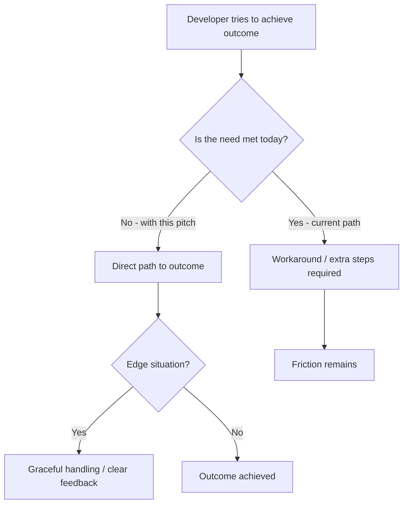
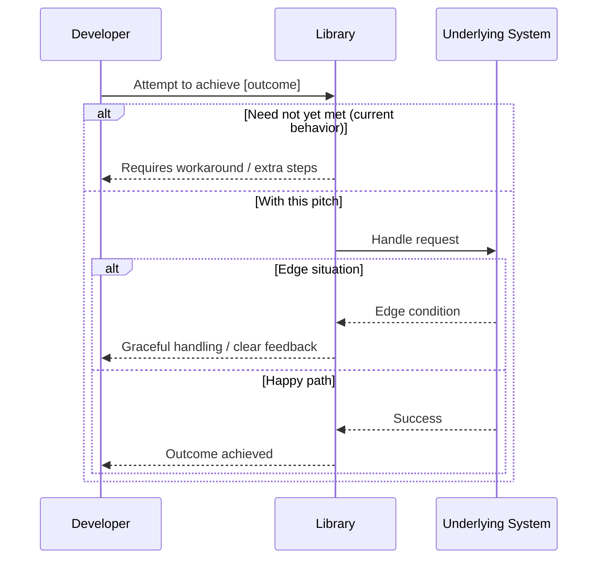

## 1. The Problem (Need & Context)
*Explain the need, not the implementation. Clarify why this is worth solving and what is at stake if it remains unsolved. Avoid prescribing a solution — focus on the context, friction, and evidence.*

*   **Context:** What is the current situation and who is affected? (e.g., type of codebase or workflow, or developer journey)
*   **Pain / Friction:** What is hard, slow, confusing, or impossible today? What workaround is required?
*   **Evidence:** How often does this happen? Any concrete examples, quotes, or usage patterns?
*   **Outcome if solved:** What will the developer be able to achieve that they can't today?

> Example framing (describe the outcome, not the method):
> As a developer using this library, I'm trying to [achieve an outcome],
> but [the friction or limitation I hit],
> which results in [impact: extra work, risk, poor experience, or blocked use case].

## 2. Proposed Direction (Optional)
*Optional. Leave this section blank if you are only pitching the problem.*

*If you have an idea, sketch it at a high level. Describe the intent and desired outcome, not the implementation. Do not prescribe method names, signatures, or architecture — focus on what should be possible.*

*   What should be possible that isn't today?
*   What should feel simpler or more consistent?
*   Any constraints or boundaries to keep in mind?

<details>
<summary>Optional: Rough sketch (not a spec)</summary>

Only include if it helps clarify the intent. This is a rough illustration, not a commitment.

```text
// e.g., sketch of the desired developer experience — names and details will change
// developer wants to accomplish [outcome] in one step without [current workaround]
```

</details>

## 3. Core Capabilities
*List the key elements that would make this pitch feel complete. Focus on outcomes and boundaries, not implementation details. Each capability should be independently understandable and verifiable, and will be used to derive tests. Do not name methods or components — describe what should be true.*

| # | Capability | Outcome (what should be possible) | How we will know it works |
|---|------------|-----------------------------------|---------------------------|
| 1 | | e.g., Developer can achieve [outcome X] without [current workaround] | e.g., [scenario] results in [observable result] |
| 2 | | e.g., The library handles [edge situation Y] gracefully | e.g., No crash / clear feedback is given |
| 3 | | e.g., The new behavior fits naturally with existing workflow Z | e.g., No extra setup or migration is needed |

**Scope boundaries (Out of Scope):**
*Explicitly list what we are not doing to keep scope clear and avoid rabbit holes.*
- [ ] Not doing A — [why it's out of scope]
- [ ] Not doing B — [why it's out of scope]

## 4. Acceptance Criteria
*Write one criterion per bullet. Each criterion must follow the GIVEN / WHEN / THEN / AND structure. Do not leave placeholders empty — delete unused AC rows. The proposal can be considered complete only if all checked criteria are met.*

### 4.1 Functional Criteria
*How to write functional criteria: Describe a single observable behavior from the developer's perspective. Focus on outcomes, not implementation. Keep each criterion independent and testable.*

*   **GIVEN** — describe the required preconditions and initial state before the action. Be specific and deterministic (system state, data setup, configuration). Do not describe the action here.
*   **WHEN** — describe the single action or trigger that causes the behavior. Use one action per criterion (e.g., an API call, event, or user interaction).
*   **THEN** — describe the single verifiable outcome that proves the behavior succeeded. It must be observable and directly testable (return value, state change, or error).
*   **AND** — _(optional)_ describe an additional outcome that must hold at the same time as the THEN. Use it for related assertions, not for a new behavior.

Templates (duplicate as needed):
- [ ] **AC1:** [Short title for functional behavior]
  - **GIVEN** [how to write: initial context/state before the action]
  - **WHEN** [how to write: single action that triggers the behavior]
  - **THEN** [how to write: observable, testable result]
  - **AND** [how to write: additional assertion that holds with THEN] _(optional)_
- [ ] **AC2:** [Short title]
  - **GIVEN** [preconditions / setup]
  - **WHEN** [action]
  - **THEN** [expected outcome]
  - **AND** [additional outcome] _(optional)_
- [ ] **AC3:** [Short title]
  - **GIVEN** [preconditions / setup]
  - **WHEN** [action]
  - **THEN** [expected outcome]
  - **AND** [additional outcome] _(optional)_

### 4.2 Non-Functional Criteria
*How to write non-functional criteria: Describe a measurable constraint or quality attribute. Each criterion must be quantifiable and verifiable with tools (benchmarks, linters, compatibility matrix). Avoid vague terms like "fast" or "compatible" without a threshold.*

*   **GIVEN** — describe the baseline, environment, or condition under which the measurement applies (benchmark, runtime list, dataset, or branch state).
*   **WHEN** — describe the operation or measurement being performed (executing under load, running on a target runtime, measuring coverage).
*   **THEN** — describe the quantifiable threshold that must be met (e.g., regression <= X%, works without modification, coverage >= Y%). Must include a number or clear pass/fail rule.
*   **AND** — _(optional)_ describe how the result is evidenced or reported (CI metric, report artifact, or failure mode).

Templates:
- [ ] **AC4:** [Short title for quality attribute]
  - **GIVEN** [how to write: baseline/environment/condition]
  - **WHEN** [how to write: operation or measurement]
  - **THEN** [how to write: threshold with number or pass/fail rule]
  - **AND** [how to write: evidence/reporting requirement] _(optional)_
- [ ] **AC5:** [Short title]
  - **GIVEN** [baseline / environment]
  - **WHEN** [operation]
  - **THEN** [threshold]
  - **AND** [evidence] _(optional)_

### 4.3 Test / QA Criteria
*How to write Test/QA criteria: Describe how verification will be performed. Each criterion must define the setup, execution, and the proof that the test was successful. Link back to Section 3 where applicable.*

*   **GIVEN** — describe the test setup or artifact state (clean checkout, capability ID from Section 3, verification instructions available).
*   **WHEN** — describe the verification step being executed (running a specific test suite, executing a CI job, following manual steps).
*   **THEN** — describe the proof of success (all tests pass for Input -> Expected Output, CI jobs are green, behavior is reproducible).
*   **AND** — _(optional)_ describe traceability or secondary proof (test linked to capability, no new warnings, setup/teardown documented).

Templates:
- [ ] **AC6:** [Short title for verification]
  - **GIVEN** [how to write: test setup / required artifact state]
  - **WHEN** [how to write: verification step executed]
  - **THEN** [how to write: proof of success]
  - **AND** [how to write: traceability or secondary proof] _(optional)_
- [ ] **AC7:** [Short title]
  - **GIVEN** [test setup]
  - **WHEN** [verification step]
  - **THEN** [proof of success]
  - **AND** [secondary proof] _(optional)_
- [ ] **AC8:** [Short title]
  - **GIVEN** [test setup]
  - **WHEN** [verification step]
  - **THEN** [proof of success]
  - **AND** [secondary proof] _(optional)_

## 5. Flow Diagram
*Sketch the journey at a high level — happy path + key alternative paths. Keep it focused on what the developer experiences, not technical architecture. Provide either a Flow Diagram or a Sequence Diagram (choose one and delete the other). Both use Mermaid, which is rendered natively on GitHub. A textual fallback is also provided.*

**Option A — Flow Diagram (flowchart):**


**Option B — Sequence Diagram:**


**Textual flow (alternative if Mermaid is not needed):**
1.  Developer attempts [outcome] ->
2.  [Current friction or happy path step] ->
3.  [System/library response — success or graceful handling] ->
4.  Outcome achieved / feedback given

## 6. Additional Context
*Add any other context, links, related issues/PRs, or screenshots about the feature request here.*

- Related Issue: #
- References / Inspiration: [link]
- Breaking Change? Yes / No
